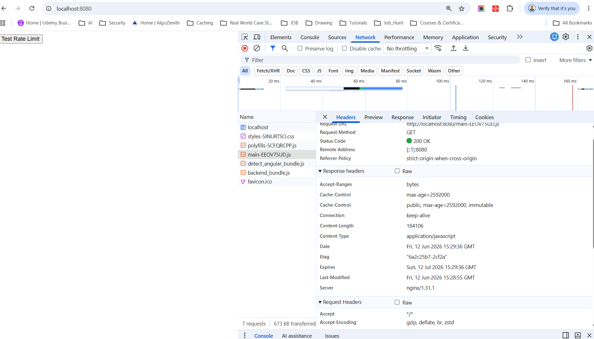
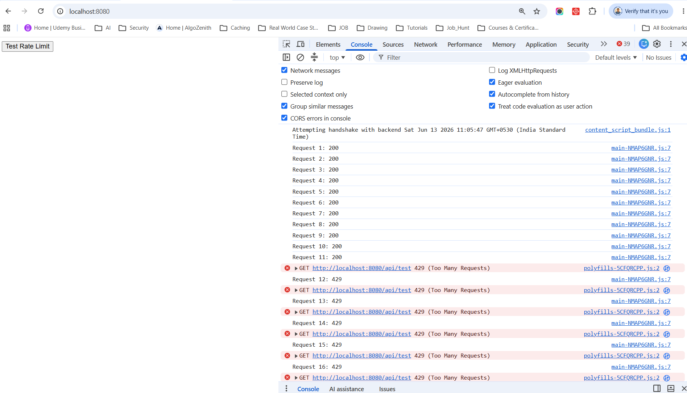
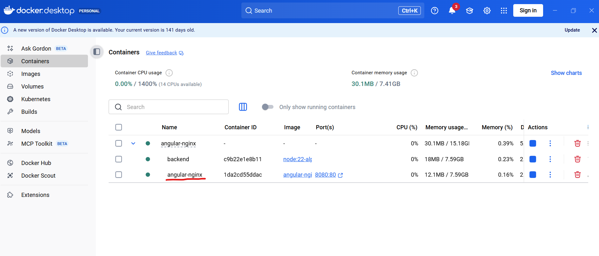
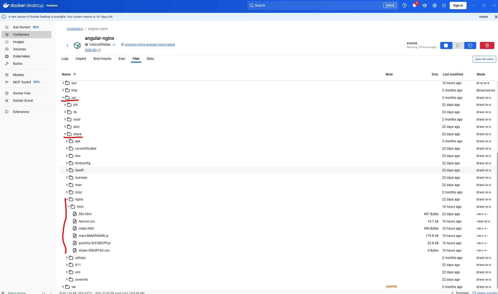
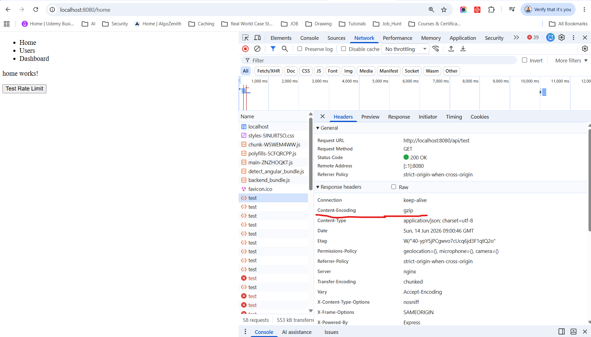

# NGINX with Angular  (Deploying Angular App with NGINX and Docker)

**Here's a complete example that demonstrates:**
+ Serve Angular Static Files
+ Cache Static Assets
+ Rate Limiting
+ Nginx try_files fallback to index.html
+ Enable gzip/brotli compression
+ Security headers
+ Health check endpoint
+ Proper WebSocket support (Socket.IO)
+ Dockerized Angular + Nginx

**Tutorials**
1. Deploy angular app on nginx from scratch | Deploying angular in nginx server on Windows : https://www.youtube.com/watch?v=Wf-6idVVis4
2. Dockerize an Angular Application using Nginx : https://www.youtube.com/watch?v=-o5l6zFJ9_o
3. How to Deploy an Angular Application 2024 (Docker, Nginx & Digitalocean) : https://www.youtube.com/watch?v=ERVAFkj66QQ
4. deploying-angular-apps-nginx-docker : https://www.telerik.com/blogs/deploying-angular-apps-nginx-docker

## Run Application

```
docker compose up -d --build
```

Whenever you modify Angular code:
```
docker compose down
docker compose build --no-cache
docker compose up -d
```
This will:
1. npm run build
2. Generate dist/angular-nginx/browser
3. Create new Docker image
4. Restart Nginx container


**Now Open browser**
```
http://localhost:8080/
```


1. Nginx Cache static assets aggressively
---------------------------------------------------------------------------------
Your screenshot actually proves that Nginx caching is configured correctly.

I can see these response headers:
```
Cache-Control: max-age=2592000
Cache-Control: public, max-age=2592000, immutable
Expires: Sun, 14 Jul 2026 ...
ETag: "..."
Last-Modified: ...
```
So Nginx is telling Chrome:
```
Cache this file for 30 days.
```

**✅ "Nginx is serving the Angular build files, and Angular is running in the user's browser."**

**Production Enterprise Flow**
```
User
 │
 ▼
NGINX
 │
 ├── Angular Static Files
 │      └── Cached 30 Days
 │
 └── API Requests
        │
        └── Rate Limited
                │
                ▼
            Backend
```

**Verify Static Asset Caching**

Open browser DevTools → Network. You should see headers similar to:
```
Cache-Control: public,max-age=2592000
Expires: Sun, 14 Jul 2026 ...
```
This means:
```
logo.png
main.js
styles.css
```
Cached for 30 days

2. NGINX Rate Limiting
---------------------------------------------------------------------------------
**Click on "Test rate limit" button**  


Click:
```
Trigger 30 API Calls
```
Nginx allows:
```
5 requests/sec
Burst = 10
```
You will see:
```
200 OK
```
for allowed requests and eventually:
```
429 Too Many Requests
```
for excess requests.

## /usr/share/nginx/html
/usr/share/nginx/html is the default web root directory inside the Nginx container.
Think of it as:
```
Browser Request
      │
      ▼
http://localhost:8080/index.html
      │
      ▼
Nginx looks here:
/usr/share/nginx/html/index.html
```

**In My Docker setup**

Your Angular production build creates:
```
dist/
└── angular-nginx/
    └── browser/
        ├── index.html
        ├── main.js
        ├── styles.css
        └── assets/
```
Dockerfile probably contains:
```
FROM nginx:alpine

COPY --from=build \
     /app/dist/angular-nginx/browser \
     /usr/share/nginx/html
```
This copies Angular files into Nginx's web root.

After the copy:
```
/usr/share/nginx/html
├── index.html
├── main.js
├── styles.css
└── assets
```




3. Nginx try_files fallback to index.html
---------------------------------------------------------------------------------
When deploying an Angular application inside Docker with Nginx, one of the most common issues is:
```
Angular routes work when navigating from the UI, but fail with 404 Not Found when refreshing the page or directly accessing a route.
```
Example:
```
Works:
http://localhost/dashboard

Refresh page:
404 Not Found
```
This happens because Angular uses client-side routing, while Nginx tries to find a physical file called:
```
/dashboard
```
which does not exist.

**Solution Architecture**
```
Browser
   │
   ▼
Nginx Container
   │
   ├── /assets/*
   ├── /main.js
   ├── /styles.css
   │
   └── Any Angular Route
           │
           ▼
       index.html
           │
           ▼
     Angular Router
           │
           ├── /dashboard
           ├── /users
           └── /settings
```

**Why try_files is Important**   
This configuration ensures that all routes are handled by the Angular application.  

Without:
```
location / {
}
```
Request:
```
/dashboard
```
Nginx searches:
```
/usr/share/nginx/html/dashboard
```
Result:
```
404
```
With:
```
try_files $uri $uri/ /index.html;
```
**Flow:**
```
/dashboard
      │
      ▼
File exists?
      │
      ├─ Yes → Serve file
      │
      └─ No
            │
            ▼
        index.html
            │
            ▼
      Angular Router
```
**This gives:**
- /unknown-page → Angular NotFoundComponent
- /assets/unknown.png → Nginx 404.html
- /main.js missing → Nginx 404.html

4. Enable gzip/brotli compression
---------------------------------------------------------------------------------
Gzip is a compression algorithm that reduces the size of files sent from the server to the browser.



Instead of sending:
```
main.js = 5 MB
```
Nginx compresses it:
```
main.js.gz = 1 MB
```
and sends the compressed version to the browser. The browser automatically decompresses it before executing the JavaScript.

**Nginx Gzip Configuration**
```
gzip on;

gzip_vary on;

gzip_comp_level 6;

gzip_min_length 60;

gzip_types
    text/plain
    text/css
    application/json
    application/javascript
    application/xml
    text/xml
    image/svg+xml;
```
Expected improvements:
```
JavaScript Size Reduction: 60–80%
CSS Size Reduction: 70–90%
API JSON Reduction: 70–95%
Page Load Improvement: 30–60%
Bandwidth Savings: Significant
```

## Why NGINX is the Standard for Angular in Production

Yes, it is highly correct and considered an industry best practice to run a production Angular application on an NGINX server.While you use the ng serve command during development, that built-in server is designed exclusively for a local development workflow and lacks the performance, security, and optimization capabilities required for live environments.

**✅ NGINX is the standard for Dockerized Angular applications because it creates the smallest, fastest, and most secure container possible.When you containerize a frontend application, your goal is to package the built static assets into an isolated environment that can boot up instantly anywhere. NGINX fits perfectly into the Docker philosophy of "one responsibility per container" while maintaining an incredibly low resource footprint.** 
**✅ NGINX is chosen for production Angular apps because it is built for speed, stability, and handling high user traffic.When Angular compiles for production, it transforms into standard static files (HTML, CSS, and JavaScript). NGINX is globally recognized as one of the fastest and most reliable web servers for delivering these specific types of files to users.**  
**✅ Angular can run in Docker without Nginx using ng serve (development).**   
**✅ For production, Angular is usually served by Nginx (or another web server) inside Docker because Angular becomes static files after ng build.**  
**✅ In production, Angular is usually served through Nginx, not directly through Angular's development server (ng serve).**   

## The Main Reasons NGINX is Chosen
- **Blazing Fast Speed**: NGINX handles user traffic differently than servers like Node.js or Apache. It uses an "event-driven" architecture. This means a single NGINX server can handle tens of thousands of simultaneous users at the exact same time while using almost no computer memory.
- **Fixes the Angular "404 Refresh" Problem**: Angular is a Single Page Application (SPA). If a user goes directly to a page like ://yoursite.com and hits refresh, a normal server looks for a folder named "profile" and crashes with a 404 error. NGINX can easily be told to send all these requests back to Angular's index.html file, letting your app handle the routing smoothly.
- **Shrinks File Sizes (Compression)**: Angular JavaScript files can be quite large. NGINX has built-in, powerful Gzip and Brotli compression features. It automatically shrinks your code files before sending them over the internet, making your website load much faster on mobile phones and slow connections.
- **Acts as a Secure Shield (Reverse Proxy)**: NGINX can sit in front of your database and backend APIs. It can accept all requests from the internet, handle the SSL certificates (HTTPS) securely, and safely forward API calls to your backend servers. This keeps your actual database hidden and safe.
- **Saves Money on Server Costs**: Because NGINX is so lightweight, you do not need to buy expensive, high-powered cloud servers. A tiny, cheap server running NGINX can easily handle the traffic of a large production website.

## NGINX vs ng serve (Angular Dev server)

| Feature           | `ng serve` (Development)               | NGINX (Production)                 |
| ----------------- | -------------------------------------- | ---------------------------------- |
| **Purpose**       | Code building, live testing, debugging | Speed, high security, mass traffic |
| **Memory Use**    | Very High (hundreds of MBs)            | Microscopic (around 15–30 MB)      |
| **Security**      | None (vulnerable to attacks)           | Extremely High (enterprise grade)  |
| **File Delivery** | Uncompressed, slow                     | Heavily compressed, instant        |

| Feature                     | `ng serve`      | NGINX                 |
| --------------------------- | --------------- | --------------------- |
| **Hot Reload**              | ✅ Yes           | ❌ No                  |
| **Production Ready**        | ❌ No            | ✅ Yes                 |
| **Load Balancing**          | ❌ No            | ✅ Yes                 |
| **Gzip/Brotli Compression** | ❌ No            | ✅ Yes                 |
| **Caching**                 | ❌ No            | ✅ Yes                 |
| **SSL/TLS Support**         | Basic           | Enterprise-grade      |
| **Reverse Proxy**           | ❌ No            | ✅ Yes                 |
| **Static File Serving**     | Slow            | Extremely Fast        |
| **Concurrent Users**        | Hundreds        | Thousands to Millions |
| **Docker Deployment**       | Not Recommended | Recommended           |

## Development Environment
```
Browser
   │
   ▼
Angular Dev Server
(ng serve)
   │
   ▼
localhost:4200
```
Used only during development.

## Production Architecture
```
                Browser
                   │
                   ▼
                Nginx
                   │
                   ▼
            Angular Files
        (HTML, JS, CSS, Assets)
```
**When you run:**
```
ng build --configuration production
```
**Angular generates:**
```
dist/
 ├── index.html
 ├── main.js
 ├── polyfills.js
 ├── styles.css
 └── assets/
```
Nginx serves these files.

## Angular + Nginx + Backend

Most common architecture:
```
                    Browser
                       │
                       ▼
                    Nginx
                 (Port 80/443)
                       │
          ┌────────────┴────────────┐
          ▼                         ▼
    Angular Files              Node.js API
   /index.html                /api/*
   /main.js
```

Example:
```
https://mybank.com
```
Served by Nginx.
```
https://mybank.com/api/login
```
Forwarded by Nginx to Node.js.

## Why Nginx is Used for Angular

**1. Serve Static Files Efficiently**

Angular files:
```
index.html
main.js
styles.css
```
Nginx is extremely fast at serving them.

**2. Gzip/Brotli Compression**

Without compression:
```
main.js = 8 MB
```
With Nginx:
```
main.js = 1.5 MB
```
Faster page loads.

**3. HTTPS / SSL**
```
Browser
   │ HTTPS
   ▼
 Nginx
```
Nginx manages SSL certificates.

Angular doesn't need to.

**4. Caching**
```
main.js
styles.css
logo.png
```
Can be cached by Nginx.
```
location ~* \.(js|css|png|jpg)$ {
    expires 1y;
}
```

**5. Reverse Proxy**
```
Angular
   │
   ▼
Nginx
   │
   ▼
Node.js API
```
Users see:
```
https://mybank.com
```
instead of:
```
https://mybank.com:3000
```

## Enterprise Banking Setup
```
                Customer Browser
                       │
                       ▼
                    Nginx
              SSL + Load Balancer
                       │
          ┌────────────┴────────────┐
          ▼                         ▼
      Angular UI              Node.js APIs
                                   │
                                   ▼
                                 Redis
                                   │
                                   ▼
                              Database
```

Angular is typically built into static files (HTML, JavaScript, CSS) using ng build. 
Nginx serves these static assets, handles HTTPS, compression, browser caching, and acts as a reverse proxy for backend APIs.
In production, users access Angular through Nginx rather than the Angular development server.

## Enterprise Angular + Node.js + Redis + Nginx
```
                     Browser
                        │
                        ▼
                 ┌────────────┐
                 │   Nginx    │
                 └─────┬──────┘
                       │
        ┌──────────────┼──────────────┐
        ▼                             ▼
 Angular Static Files          Node.js APIs
                                     │
                                     ▼
                               Redis Cache
                                     │
                                     ▼
                                 Database
```

**Request Flow**
1. Browser requests Angular app → Nginx serves static files.
2. Angular calls /api/orders.
3. Nginx forwards request to Node.js.
4. Node.js checks Redis cache.
5. If cache miss → database query.
6. Result stored in Redis.
7. Response returned through Nginx.

## Angular normally can't run inside Docker without Nginx ?
Yes, Angular can run inside Docker without Nginx, but it depends on whether you're running it in development mode or production mode.

Option 1: Angular without Nginx (Development)
----------------------------------------------------------------------------------
You can run Angular's built-in development server (ng serve) inside Docker.

**Dockerfile**
```
FROM node:22

WORKDIR /app

COPY package*.json ./
RUN npm install

COPY . .

EXPOSE 4200

CMD ["npm", "start"]
```

**Run**
```
docker build -t angular-app .
docker run -p 4200:4200 angular-app
```

**Angular CLI starts:**
```
ng serve --host 0.0.0.0
```

**Architecture:**
```
Browser
   │
   ▼
Angular Dev Server (ng serve)
   │
   ▼
Docker Container
```

**Problems**
- Not optimized
- Larger memory usage
- Slower
- No compression
- No caching
- Not recommended for production


Option 2: Angular with Nginx (Production)
----------------------------------------------------------------------------------
**Build Angular and serve static files through Nginx.**
```
Build Angular
ng build --configuration production
```

**Generated files:**
```
dist/
 ├── index.html
 ├── main.js
 ├── styles.css
 └── assets/
```

**Dockerfile**
```
# Build Stage
FROM node:22 AS build

WORKDIR /app

COPY . .
RUN npm install
RUN npm run build

# Runtime Stage
FROM nginx:alpine

COPY --from=build /app/dist/my-app/browser /usr/share/nginx/html

EXPOSE 80
```

**Architecture:**
```
Browser
   │
   ▼
Nginx
   │
   ▼
Angular Static Files
(index.html, JS, CSS)
```

**Benefits:**
- Fast
- Gzip compression
- Browser caching
- SPA routing support
- Production ready


